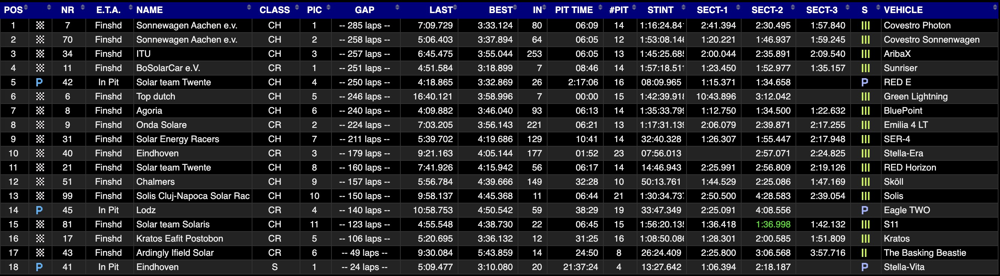
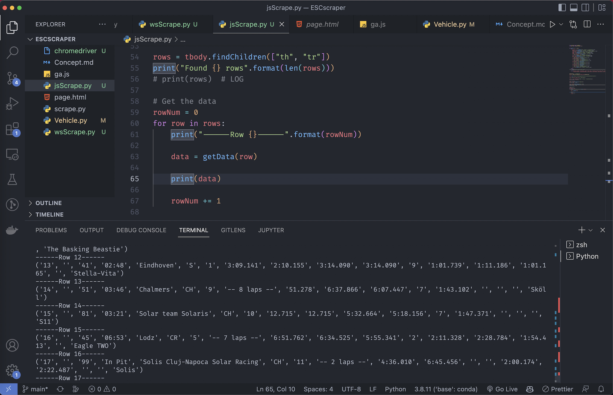

# ESCScraper

This project scrapes the live data from the Ilumen European Solar Challenge 2022 competition for educational and research purposes.

---

## Planning

1. Read data from [Live Track Results](https://livetiming.getraceresults.com/zolder#screen-results)

1. Scrape the table every 30 seconds and record the data

1. Store the data in db

1. Visualise data somewhere in realtime

# Implementation

- **Step 1 and 2**:
    During the 24 hours the data is filtered in each row and is appended in a Vehicle objects.
    the `/data` directory contains the live track data for each vehicle.

    

- **Step 3 and 4**:
    TODO
